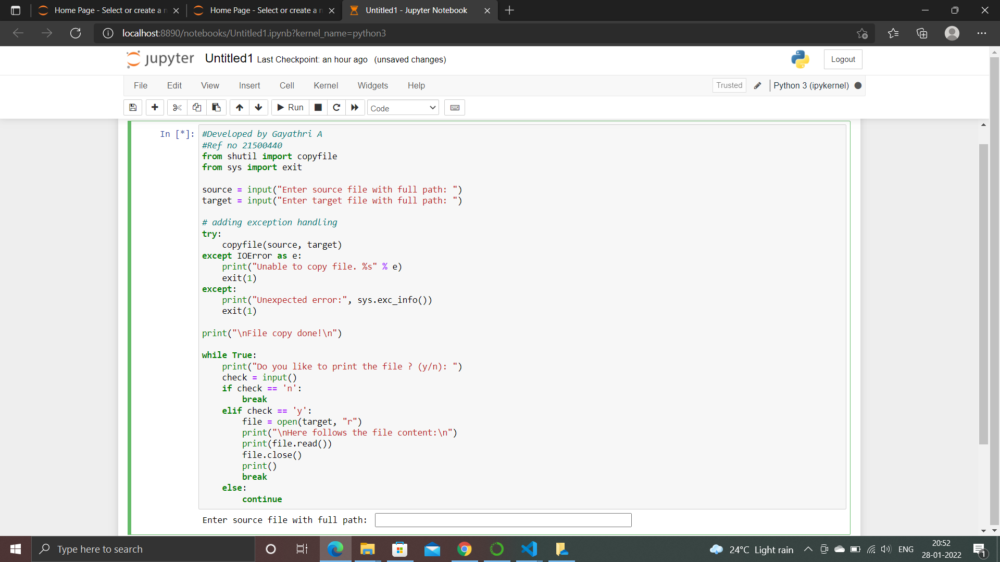

# copy-file
## AIM:
To write a python program for copying the contents from one file to another file.
## EQUIPEMENT'S REQUIRED: 
PC
Anaconda - Python 3.7
## ALGORITHM: 
### Step 1:
First we need to open the required file from which we need to copy the text.
### Step 2: 
Using keyword"with"to open the required file.
### Step 3: 
Again using the with keyword to open the empty file.
### Step 4:  
The empty file is open by using "w"which is used to write only.
### Step 5: 
The for function is used to take each line from the main file.
### Step 6: 
write() is used to write the lines of main file to the empty file or to the directed file.
## PROGRAM:
```python
#Developed by Gayathri A
#Ref no 21500440
from shutil import copyfile
from sys import exit

source = input("Enter source file with full path: ")
target = input("Enter target file with full path: ")

# adding exception handling
try:
    copyfile(source, target)
except IOError as e:
    print("Unable to copy file. %s" % e)
    exit(1)
except:
    print("Unexpected error:", sys.exc_info())
    exit(1)

print("\nFile copy done!\n")

while True:
    print("Do you like to print the file ? (y/n): ")
    check = input()
    if check == 'n':
        break
    elif check == 'y':
        file = open(target, "r")
        print("\nHere follows the file content:\n")
        print(file.read())
        file.close()
        print()
        break
    else:
        continue
```
### OUTPUT:


## RESULT:
Thus the program is written to copy the contents from one file to another file.